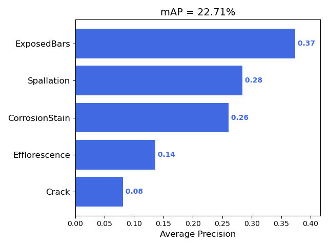
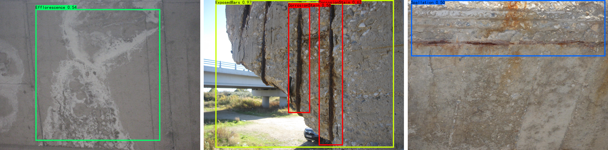

# cognitive-bridge-inspection

An investigation of individual cognitive reliability in bridge inspection

## **COncrete DEfect BRidge IMage (CODEBRIM) Dataset**

The [CODEBRIM Dataset](http://openaccess.thecvf.com/content_CVPR_2019/html/Mundt_Meta-Learning_Convolutional_Neural_Architectures_for_Multi-Target_Concrete_Defect_Classification_With_CVPR_2019_paper.html) consists of 1,590 high-resolution images (maximum resolution 6000×4000) from 30 different bridges with five types of bridge defects, including crack, spallation, exposed reinforcement bar, efflorescence, corrosion (stains).

This study implemented the YOLO-v4 model (Bochkovskiy et al. 2020) to detect bridge defects for its efficiency and high detection accuracy. The CODEBRIM Dataset is randomly split into a training subset with 80% images and a testing subset with 20% images. The mAP results are shown as follows:

     
    Detection results for the CODEBRIM test subset (IoU=0.5).

     
    YOLO-v4 detection results for bridge defects.

The pretrained YOLO-v4 model is available from [Google Drive](https://drive.google.com/file/d/1ELDgScbCamsB-RRHTLC8AXXqf1gZw7rD/view?usp=sharing).

## **Acknowledgements**

COncrete DEfect BRidge IMage Dataset (CODEBRIM) credits: https://zenodo.org/record/2620293#.YHO0S-hKibg
