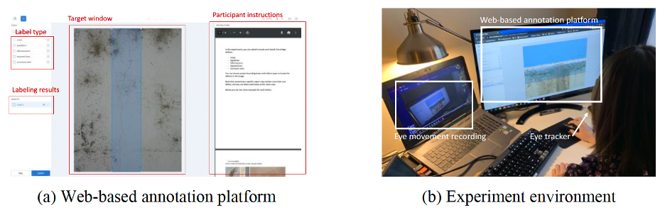
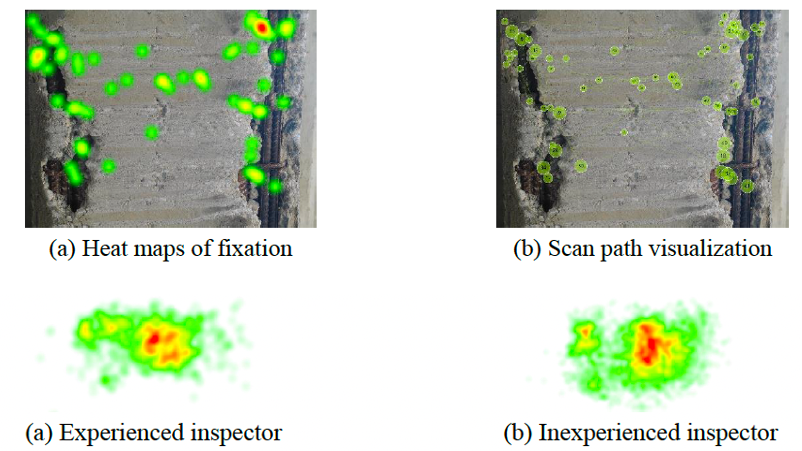

# *Human Reliability Analysis and Prediction for Visual Inspection in Bridge Maintenance*

This paper presents an automated personalized assessment and calibration system thatmodels the inspector’s performance individually by analyzing their cognitive records oncompleted tasks over a certain period.

# *Computer Simulated Inspection System.*

- A web-based annotation platform based on LabelBox (Labelbox2021) that can capture interaction features from users’ log files
- A behavioral trackingmodule that utilizes the Tobii Pro Glasses 3 eye tracker to record observations and cognitivebehaviors.




# eye tracking behavior analysis




|          Eye movement patterns          | Inexperienced participants | Experienced participants |
| :-------------------------------------: | -------------------------- | ------------------------ |
| *Mean fixation duration (milliseconds)* | 593(471)                   | 530(380)                 |
| *Mean saccade duration (milliseconds)*  | 44(26)                     | 43(23)                   |
| Mean saccadic velocity(degrees/second)  | 245.27(153.87)             | 235.79(127.1)            |
|       Pupil diameter(millimeters)       | 4.00(0.29)                 | 3.66(0.25)               |
|                                         |                            |                          |

## **Human performance vs. Computer perfrormance**

The [CODEBRIM Dataset](http://openaccess.thecvf.com/content_CVPR_2019/html/Mundt_Meta-Learning_Convolutional_Neural_Architectures_for_Multi-Target_Concrete_Defect_Classification_With_CVPR_2019_paper.html) consists of 1,590 high-resolution images (maximum resolution 6000×4000) from 30 different bridges with five types of bridge defects, including crack, spallation, exposed reinforcement bar, efflorescence, corrosion (stains).

This study implemented the YOLO-v4 model (Bochkovskiy et al. 2020) to detect bridge defects for its efficiency and high detection accuracy. The CODEBRIM Dataset is randomly split into a training subset with 80% images and a testing subset with 20% images. The mAP results are shown as follows:

<div align="center">
    <br>
    <sup>Detection results for the CODEBRIM test subset (IoU=0.5).
</div>

<div align="center">
    <br>
    <sup>YOLO-v4 detection results for bridge defects.
</div>

The pretrained YOLO-v4 model is available from [Google Drive](https://drive.google.com/file/d/1ELDgScbCamsB-RRHTLC8AXXqf1gZw7rD/view?usp=sharing).

## **Acknowledgements**

COncrete DEfect BRidge IMage Dataset (CODEBRIM) credits: https://zenodo.org/record/2620293#.YHO0S-hKibg

## Further reading

```
@incollection{xiong2022human,
  title={Human Reliability Analysis and Prediction for Visual Inspection in Bridge Maintenance},
  author={Xiong, Ruoxin and Liu, Pengkun and Tang, Pingbo},
  booktitle={Computing in Civil Engineering 2021},
  pages={254--262},
  year={2022}
}
```

